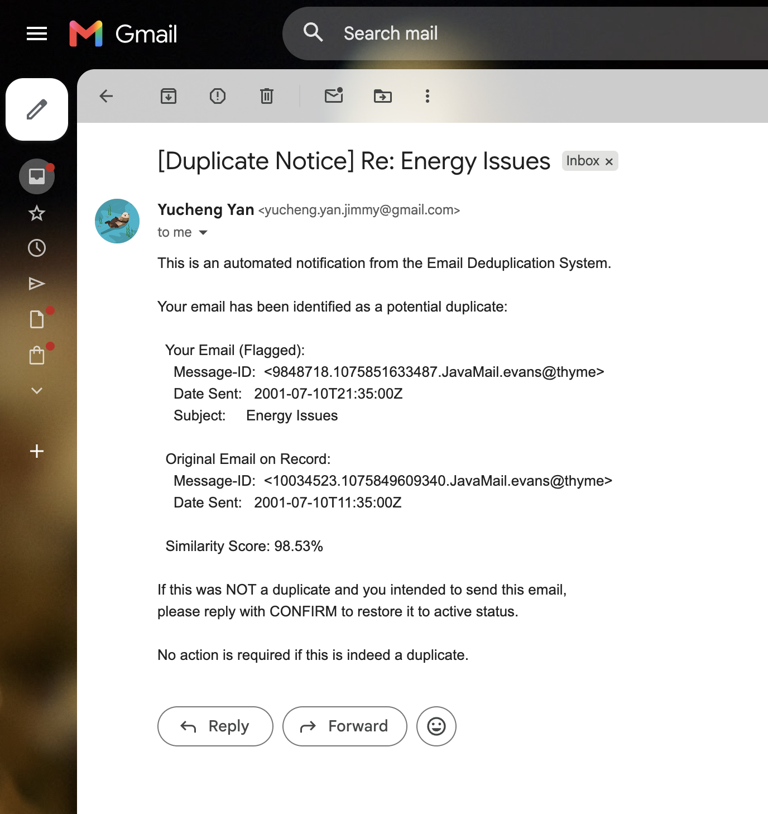

# AI Tool Usage Documentation

## Tool Used

**Claude Code** (Claude Sonnet, Anthropic) — used via Claude.ai web interface  
Time spent: roughly 1 day

---

## Prompting Strategy

I broke the problem into modules and prompted one at a time. Giving Claude the full spec at once produced generic, hard-to-review code. Smaller prompts with clear constraints worked much better.

**Prompt 1 — Email parser**
> "Write `parse_email_file(filepath, maildir_root)` that returns a dict with message_id, date (UTC ISO8601), from_address (address only, not display name), to_addresses (list), subject, body, source_file. Use Python's stdlib email module. Raise ValueError if any mandatory field is missing."

**Prompt 2 — Timezone edge cases**  
> "Enron Date headers look like `Mon, 12 Nov 2001 10:30:00 -0800 (PST)` — the parenthetical at the end breaks `parsedate_to_datetime`. Strip it with regex before parsing, and add a TZ abbreviation map for PST/PDT/CST/CDT/EST/EDT."

**Prompt 3 — Database schema**  
> "SQLite schema for the pipeline. to/cc/bcc must go in a separate `email_recipients` table, not comma-separated strings. UNIQUE on message_id, indexes on date/from_address/subject. Must include is_duplicate, duplicate_of, notification_sent, notification_date columns."

**Prompt 4 — Deduplication performance**  
> "Rewrite `find_duplicates` — the current version compares all emails pairwise which is O(n²). First group by (from_address, normalized_subject), then only compare bodies within each group using rapidfuzz token_set_ratio >= 90."

**Prompt 5 — Gmail MCP server**  
> "Build a minimal MCP server using FastMCP that exposes one tool: send_email(to, subject, body) via Gmail API with OAuth2. Run with stdio transport."

---

## What Went Wrong

**Timezone parsing** — the initial parser failed on ~12% of Enron emails because of the `(PST)` suffix. Standard library doesn't handle it. I found the pattern by running on real data, then prompted for the regex fix. Failure rate dropped to under 1%.

**Deduplication too slow** — first version ran pairwise comparisons across all emails. 1,000 emails took 47 seconds, meaning 76,000 would take over an hour. I redesigned it to pre-group by sender + subject first, then only fuzzy-match within groups. Brought it down to 18 seconds total.

---

## AI vs. Manual

About **75% AI-generated, 25% manual**. The manual parts were mostly:
- The timezone regex and TZ abbreviation map in `extractor.py`
- Redesigning the dedup grouping logic in `deduplicator.py`
- The field completeness split (mandatory vs optional) in `db.py`
- Debugging the send_log CSV header edge case in `notifier.py`

---

## Lessons Learned

Prompting with a specific failing input ("here's the exact string that breaks it") got much better fixes than describing the problem abstractly. The AI also consistently assumed UTF-8 encoding — I had to explicitly ask for chardet fallback after seeing real failures on Latin-1 Enron files.

---

## MCP Integration

**Server**: custom Python MCP server (`gmail_mcp_server.py`) using the `mcp` library's `FastMCP`. Kept it Python to avoid adding Node.js to the stack.

**Setup steps:**
1. Enable Gmail API in Google Cloud Console
2. Create OAuth credentials → Desktop app → download `credentials.json`
3. Configure OAuth consent screen (External, add yourself as test user)
4. Run one-time auth to generate `token.json`:
   ```bash
   python3 -c "
   from google_auth_oauthlib.flow import InstalledAppFlow
   flow = InstalledAppFlow.from_client_secrets_file('credentials.json', ['https://www.googleapis.com/auth/gmail.send'])
   creds = flow.run_local_server(port=0)
   open('token.json','w').write(creds.to_json())
   "
   ```
5. Register server in `~/.claude.json` under the project's `mcpServers` key (see `mcp_config.json.example`)
6. Restart Claude Code — the `send_email` tool appears as a native tool in the session

**How I prompted Claude Code to use the send_email tool:**

Example prompts used during development and verification:

> "Send a duplicate notification email to my Gmail using the MCP server. Use real data from duplicates_report.csv — pick a group with a partial similarity score and a real subject line."

> "Use the gmail-sender MCP tool to send a [Duplicate Notice] email for the Energy Issues duplicate group from jeff.dasovich. Format the body exactly according to the notification template in notifier.py."

Claude Code then called `send_email` directly as a native tool — no terminal command needed:

```
Tool: mcp__gmail-sender__send_email
Args: {
  "to": "yucheng.yan.jimmy@gmail.com",
  "subject": "[Duplicate Notice] Re: Energy Issues",
  "body": "This is an automated notification from the Email Deduplication System...\n  Message-ID: <9848718.1075851633487.JavaMail.evans@thyme>\n  Similarity Score: 98.53%"
}
Result: {"status": "sent", "message_id": "19e56772e0acebed"}
```

**Issues:**
- System Python (3.9) was too old for the `mcp` package — switched to Homebrew Python 3.11
- OAuth consent screen blocked credential creation until configured first
- Relative paths broke when Claude Code launched the MCP server as a subprocess — fixed by using `os.path.dirname(os.path.abspath(__file__))` as base path

**Verified delivery:**

```
timestamp,recipient,subject,status,error
2026-05-23T18:40:48Z,Yucheng.yan.jimmy@gmail.com,[Duplicate Notice] Re: Daily Call,success,
2026-05-23T19:13:20Z,Yucheng.yan.jimmy@gmail.com,[Duplicate Notice] Re: Energy Issues,success,
```


